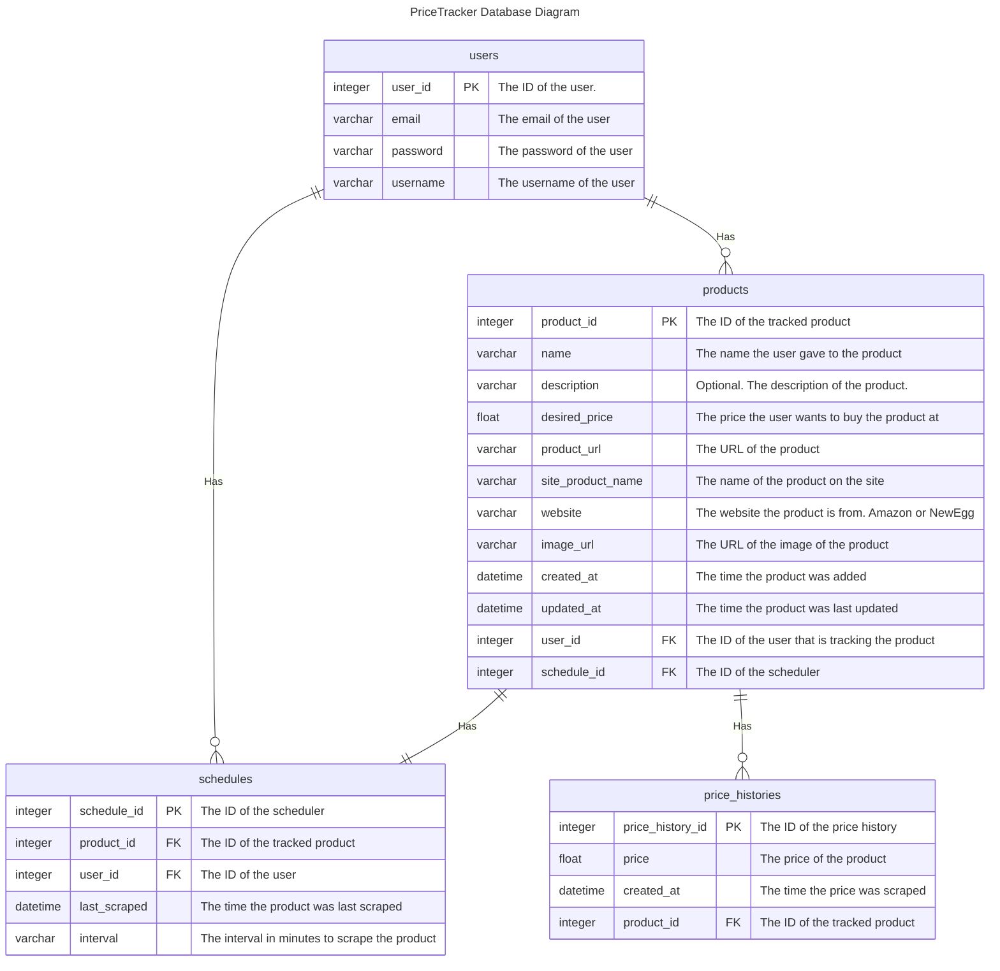
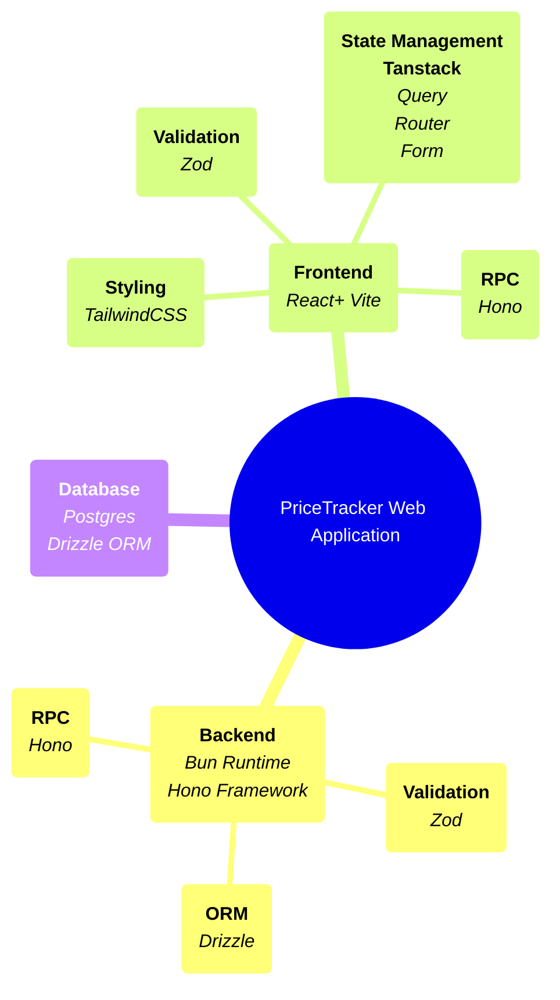

# PriceTracker Web Application

The PriceTracker web application is a project that tracks the price of products on Amazon and NewEgg websites.

The project is split into different modules each serving a different purpose.

The project is built using the Bun runtime and the Hono framework for the server-side and the frontend is built using Vite and React.

The project uses a Postgres database to store the tracked products and the tracked prices. The project uses the Drizzle ORM to interact with the database.

The project uses the Hono RPC to communicate between the server and the frontend.

## Environment Variables

The PriceTracker application requires environment variables in order for the application to run as intended, these environment variables are:

- **PORT**: The port of the server.
- **DATABASE**: The connection string of the SQL database.
- **ADMIN_USERNAME**: The username of the user that will be migrated on first launch
- **ADMIN_EMAIL**: The email of the user that will be migrated on first launch
- **ADMIN_PASSWORD**: The password of the user that will be migrated on first launch
- **JWT_SECRET**: The secret key for JWT tokens
- **JWT_EXPIRE_MINS**: The expire time for jwt access tokens

## Project Structure

This project is split into different modules/directories each serving a different purpose which are:

- `tracker` directory -> Module containing the code to scrape the price of the products from Amazon and NewEgg websites.
- `scheduler` directory -> Module containing the code to schedule the scraping of the products.
- `Server` directory -> Module containing the server-side code for the web-server.
- `Frontend` directory -> Module containing the frontend code for the web application.

## Database & Schemas

The PriceTracker web application uses a Postgres database to store the tracked products and the tracked prices. The project uses the Drizzle ORM to interact with the database.

There are four (4) tables in the database which are:

- `users` -> Table to store the users of the application.

- `products` -> Table to store the products a user is tracking.

- `price_histories` -> Table to store the price history of the tracked products.

- `schedules` -> Table to store the schedules for the tracked products. A schedule is used to create the cron job for scraping the product.

The following diagram shows the relationship between the different tables in the database:

### Relationships

#### Users Table Relationships

There is a one-to-many relationship between the `users` table and the `products` table.
This is because a user can have zero or many tracked products.

There is a one-to-many relationship between the `users` table and the `schedulers` table.
This is because a user can have zero or many schedulers to schedule the scraping of the products.

#### Products Table Relationships

There is a many-to-one relationship between the `products` table and the `users` table.
This is because many tracked products can belong to a user.

There is a one-to-one relationship between the `products` table and the `schedulers` table.
This is because a tracked product can have only one schedular to schedule the sraping of the product.

There is a one-to-many relationship between the `products` table and the `price_histories` table.
This is because a tracked product can have zero or many price histories showcasing the price of the product over time.

#### Price Histories Table Relationships

There is a many-to-one relationship between the `price_histories` table and the `products` table.
This is because many price histories can belong to a tracked product to showcase the price of the product over time.

#### Schedulers Table Relationships

There is a one-to-one relationship between the `schedulers` table and the `products` table.
This is because only one scheduler can be assigned to a tracked product to schedule the scraping of the product.

There is a many-to-one relationship between the `schedulers` table and the `users` table.
This is because many schedulers can belong to a user to schedule the scraping of the products.

## Technology Stack

The following mind map shows the technology stack used in the PriceTracker web application:

